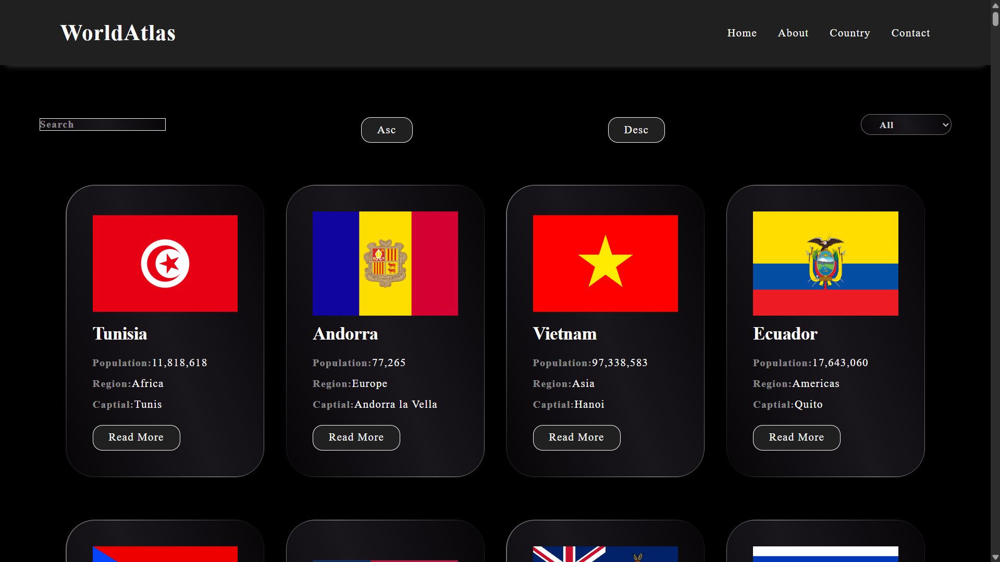

# 🌍 WorldAtlas

**WorldAtlas** is an interactive web app built with **React** and **Vite**.  
It lets users explore countries, their details, and navigate the world with a modern UI.

## 🖼️ Screenshots

## 🚀 Features

- 🔍 Search and filter countries easily  
- 🗺️ View detailed information about each country  
- 📱 Responsive design for mobile and desktop  
- ⚡ Fast development and build with Vite  

## 🛠️ Tech Stack

- **React** (Frontend library)  
- **Vite** (Build tool)  
- **REST Countries API** (Country data)  

---
